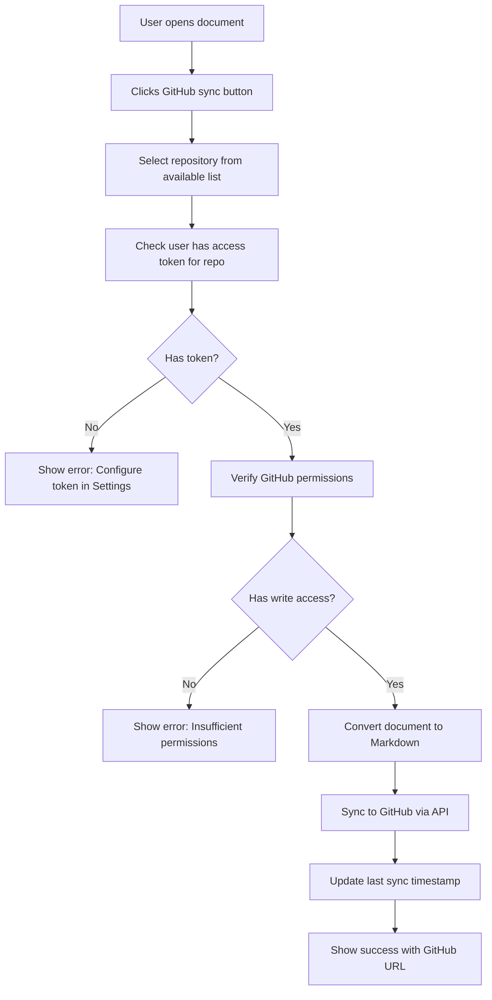

# GitHub Integration Documentation

This document explains how to set up and use the GitHub integration feature in Potion (Notion Clone).

## Overview

The GitHub integration allows you to sync your documents to GitHub repositories as Markdown files. It features a **global repository system** where:

- **Global Repository Registry**: Any user can add repositories that become visible to all users
- **Individual Access Control**: Each user must configure their own personal access tokens to actually use repositories
- **Secure Syncing**: Documents are synced using individual user tokens, ensuring proper permissions

## How It Works

### Architecture Overview

The GitHub integration uses a two-tier approach:

1. **Global Repository Management**: All users can see registered repositories but cannot access them without proper tokens
2. **Individual Access Control**: Users must provide their own GitHub Personal Access Tokens (PATs) to interact with repositories
3. **Permission Verification**: The system validates GitHub permissions in real-time before allowing operations

### Workflow Process



## Setup Process

### Step 1: Connect GitHub Profile

1. Go to **Settings** → **GitHub Integration**
2. Enter your GitHub username in the "Connect GitHub Profile" section
3. Click "Connect Profile"

This links your GitHub account to your Potion profile.

### Step 2: Add Repository to Global Registry

1. In the "Add Repository to Global Registry" section, click "Add Repository"
2. Enter the full GitHub repository URL (e.g., `https://github.com/owner/repo`)
3. Click "Add to Global Registry"

**Note**: This makes the repository visible to all users, but they can't access it without their own tokens.

### Step 3: Add Personal Access Token

1. Create a GitHub Personal Access Token:
   - Go to GitHub.com → Settings → Developer settings → Personal access tokens → Tokens (classic)
   - Generate new token with at least `repo` scope for private repos, or `public_repo` for public repos
   - Copy the token (starts with `ghp_`)

2. In Potion Settings, find the repository you want to access in step 3
3. Click "Add Token" next to the repository
4. Paste your personal access token
5. Click "Save"

### Step 4: Verify Repository Access

1. In the "Verify Repository Access" section, find repositories with configured tokens
2. Click "Check Access" to verify your token has the required permissions
3. The system will show your access level (read, write, admin)

## Sync Conditions & Requirements

### Prerequisites for Syncing

Before you can sync documents to GitHub, the following conditions must be met:

1. **Repository Registration**: The target repository must be added to the global registry
2. **Personal Access Token**: You must have configured your GitHub PAT for the target repository
3. **Permission Verification**: Your token must have verified write access to the repository
4. **Document Access**: You must have edit permissions on the document being synced

### Access Level Requirements

| Action | Minimum Required Access |
|--------|------------------------|
| View repositories | Token not required |
| Add repository to registry | Any authenticated user |
| Configure access token | Repository must exist in registry |
| Verify access | Valid token with repo scope |
| Sync documents | Write or Admin access verified |

### Token Scope Requirements

| Repository Type | Required GitHub Token Scope |
|----------------|----------------------------|
| Public repositories | `public_repo` |
| Private repositories | `repo` (full repository access) |
| Organization repos | `repo` + organization membership |

## Using GitHub Sync

### Syncing a Document

1. Open any document
2. Click the GitHub icon (📂) in the toolbar, or use the "More" menu → "Sync to GitHub"
3. In the sync modal:
   - **Select Repository**: Choose from repositories you have token access to (filtered to show only repos with verified write access)
   - **File Path**: Customize where to save (defaults to `docs/document-title.md`)
   - **Commit Message**: Custom commit message (defaults to "Update: Document Title")
   - **Sync Preview**: Review what will be synced before confirming
4. Click "Sync to GitHub"

### What Gets Synced

The system converts your BlockNote content to Markdown format, including:
- Headings (# ## ###)
- Paragraphs
- Bullet lists (-)
- Numbered lists (1.)
- Code blocks (```)
- Basic formatting

The synced file includes:
- Document title as main heading
- Converted content
- Timestamp footer
- Attribution to Potion

### Sync Behavior

- **File Creation**: New files are created if they don't exist
- **File Updates**: Existing files are overwritten with new content
- **Branch**: All syncs go to the `main` branch (branch selection coming in future updates)
- **Encoding**: Files are saved in UTF-8 with base64 encoding for GitHub API compatibility

## Architecture Details

### Database Schema

```javascript
// Global repository registry - visible to all users
githubRepositories: {
  repoUrl: string,        // Full GitHub repo URL
  owner: string,          // Repository owner
  repoName: string,       // Repository name  
  addedBy: userId,        // Who added this repository
  isActive: boolean,      // Whether repository is active
  createdAt: number,
  updatedAt: number,
}

// User-specific access to repositories
githubUserAccess: {
  userId: userId,
  repositoryId: repositoryId,
  accessToken: string,    // User's personal access token (encrypted in production)
  hasAccess: boolean,     // Whether user has verified access
  accessLevel: string,    // none, read, write, admin
  lastChecked: number,
  lastSyncedAt: number,
  createdAt: number,
  updatedAt: number,
}
```

### API Functions

#### Queries
- `getGlobalRepositories()` - Get all repositories in global registry
- `getUserRepositoryAccess()` - Get repositories with user's access status  
- `getGitHubProfile()` - Get user's connected GitHub profile
- `getRepository(repositoryId)` - Get single repository details
- `getUserAccessRecord(userId, repositoryId)` - Get user's access record for a repository

#### Mutations
- `connectGitHubProfile(username)` - Connect/update GitHub profile
- `addGlobalRepository(repoUrl)` - Add repository to global registry
- `addUserAccessToken(repositoryId, accessToken)` - Configure personal access token
- `updateUserAccess(accessId, hasAccess, accessLevel)` - Update access verification status
- `updateUserLastSync(accessId)` - Update last sync timestamp
- `removeUserAccess(repositoryId)` - Remove user's access to repository
- `removeGlobalRepository(repositoryId)` - Remove repository from global registry
- `disconnectGitHubProfile()` - Disconnect GitHub profile entirely

#### Actions
- `checkUserRepositoryAccess(repositoryId)` - Verify user's GitHub access with live API call
- `syncDocumentToRepository(documentId, repositoryId, options)` - Sync document to GitHub

## Security Features

1. **Token Isolation**: Each user's access tokens are stored separately and never shared between users
2. **Permission Verification**: Real-time GitHub API calls verify repository access before any operations
3. **Scope Validation**: Tokens are validated for required permissions before syncing
4. **Access Level Caching**: GitHub permissions are cached with timestamps to reduce API calls
5. **Error Handling**: Detailed error messages for authentication and permission issues
6. **User Authentication**: All operations require user authentication via Convex Auth
7. **Repository Ownership**: Only users who added repositories can remove them from global registry

## Error Handling & Status Codes

### Common Error Scenarios

| Error Type | Condition | User Experience | Resolution |
|------------|-----------|----------------|------------|
| No Token | User hasn't configured PAT | "Configure token in Settings" | Add personal access token |
| Invalid Token | Token expired/revoked | "Invalid access token" | Generate new token |
| Insufficient Permissions | Token lacks write access | "Insufficient permissions" | Use token with `repo` scope |
| Repository Not Found | Repo deleted/private | "Repository not found" | Verify repo exists and token has access |
| Access Denied | Token doesn't have access | "Access denied" | Check repository permissions |
| Network Error | GitHub API unavailable | "GitHub API error" | Retry operation later |

### Status Indicators

- **🟢 Verified Access**: Token validated with write/admin permissions
- **🟡 Unverified**: Token configured but not yet verified
- **🔴 Access Denied**: Token verified but insufficient permissions
- **⚪ No Token**: No personal access token configured

## Troubleshooting

### "No repositories available for syncing"

**Cause**: No repositories with configured access tokens
**Solution**: 
1. Ensure repositories are added to global registry (Step 2)
2. Configure your personal access token (Step 3)
3. Verify token has correct permissions (Step 4)

### "Access denied" errors

**Possible causes**:
- Token doesn't have required permissions (`repo` scope needed)
- Token expired or was revoked
- Repository is private and token only has `public_repo` scope

**Solution**:
1. Create new token with `repo` scope
2. Update token in Settings → GitHub Integration → Step 3
3. Re-verify access in Step 4

### "Repository not found" errors

**Possible causes**:
- Repository was deleted or moved
- Repository URL incorrect
- Token doesn't have access to private repository

**Solution**:
1. Verify repository exists and URL is correct
2. Check if repository is private and token has `repo` scope
3. Remove and re-add repository if needed

## Best Practices

### Token Management
- Use fine-grained personal access tokens when possible
- Regularly rotate access tokens
- Use minimal required scopes (`public_repo` for public repos, `repo` for private)
- Store tokens securely (never share in code or logs)

### Repository Organization
- Use consistent file paths (e.g., `docs/` for documentation)
- Include meaningful commit messages
- Consider using branch protection rules for important repositories

### Collaboration
- Team members should add their own access tokens
- Use repository-specific tokens rather than broad organization tokens
- Consider using GitHub Apps for better access control in organizations

## API Usage Examples

### Adding a Repository
```javascript
await addGlobalRepository({ 
  repoUrl: "https://github.com/owner/repo" 
});
```

### Configuring Access Token
```javascript
await addUserAccessToken({ 
  repositoryId: "repo_id", 
  accessToken: "ghp_xxxxxxxxxxxx" 
});
```

### Syncing a Document
```javascript
await syncDocumentToRepository({
  documentId: "doc_id",
  repositoryId: "repo_id",
  commitMessage: "Update documentation",
  filePath: "docs/custom-path.md"
});
```

## Limitations & Constraints

### Current Limitations

1. **Branch Support**: Only syncs to `main` branch (branch selection coming soon)
2. **File Format**: Only supports Markdown output format
3. **Sync Direction**: One-way sync only (Potion → GitHub)
4. **File Organization**: No automatic folder creation beyond specified path
5. **Conflict Resolution**: Overwrites existing files without merge conflict detection
6. **Token Storage**: Tokens stored in plaintext (encryption at rest planned)

### Performance Considerations

- **API Rate Limits**: GitHub API rate limits apply (5000 requests/hour for authenticated users)
- **File Size Limits**: GitHub file size limit of 100MB applies
- **Concurrent Syncs**: No limit on concurrent sync operations
- **Token Verification**: Cached for performance but re-verified when sync fails

## Future Enhancements

### Planned Features
- [ ] Branch selection for syncing
- [ ] Bidirectional sync (GitHub → Potion)
- [ ] Webhook integration for automatic updates
- [ ] GitHub Actions integration
- [ ] Organization-level repository management
- [ ] Token encryption at rest
- [ ] Audit logs for sync operations
- [ ] Batch sync multiple documents
- [ ] Conflict resolution for file overwrites
- [ ] Support for additional file formats (HTML, PDF)
- [ ] Repository templates and automation
- [ ] Integration with GitHub Issues and Pull Requests

### Technical Improvements
- [ ] Retry mechanism for failed syncs
- [ ] Background sync queue
- [ ] Sync progress indicators
- [ ] Diff view before overwriting files
- [ ] Repository health monitoring
- [ ] Advanced error recovery